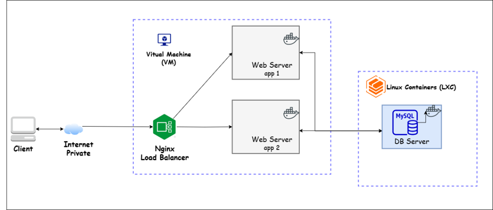

# 🚀 Flask Web App dengan Docker Compose + Monitoring (Prometheus & Grafana)

Proyek ini adalah arsitektur menggunkan Load Balancing **Flask Web App** yang dijalankan menggunakan **Docker Compose**, dengan **Prometheus** dan **Grafana** untuk monitoring.


---

## 📊 Arsitektur Sistem

Arsitektur proyek:  
[](img/arsitektur.png)

Monitoring Dashboard:  


## 📂 1. Clone Repository

Clone repository ini ke komputer atau server Anda:

```bash
git clone https://github.com/endrycofr/flask_web.git
cd flask_web
```

---

## ⚙️ 2. Buat File `.env`

Buat file `.env` di **root project** untuk konfigurasi environment:

```bash
# Aplikasi Flask
APP_PORT=8081

# Prometheus
PROMETHEUS_PORT=9090

# Grafana
GRAFANA_PORT=3000
```

> File `.env` ini digunakan oleh Docker Compose untuk membaca konfigurasi port dan environment variable.

---

## 🐳 3. Jalankan Docker Compose

Gunakan perintah berikut untuk membangun dan menjalankan container:

```bash
docker compose up -d
```

---

## 📋 4. Cek Container yang Berjalan

Untuk memastikan semua service sudah berjalan:

```bash
docker ps
```

---

## 🌐 5. Akses Layanan

- **Flask Web App** → [http://localhost:8081](http://localhost:8081)
- **Prometheus** → [http://localhost:9090](http://localhost:9090)
- **Grafana** → [http://localhost:3000](http://localhost:3000)

> Jika dijalankan di server jarak jauh, ganti `localhost` dengan **IP server** Anda.

---

## 🛑 6. Hentikan Layanan

Untuk menghentikan semua container:

```bash
docker compose down
```

---

## 📦 Struktur Project

```
flask_web/
│
├── app/
│   ├── app1/
│   │   ├── app1.py          # Flask app 1
│   │   ├── Dockerfile       # Dockerfile untuk app1
│   │   └── requirements.txt # Dependencies app1
│   │
│   └── app2/
│       ├── app2.py          # Flask app 2
│       ├── Dockerfile       # Dockerfile untuk app2
│       └── requirements.txt # Dependencies app2
│
├── nginx/
│   ├── nginx.conf            # Konfigurasi load balancer Nginx
│   └── Dockerfile            # Dockerfile Nginx (opsional, bisa pakai image official)
│
├── prometheus/
│   ├── prometheus.yml        # Config Prometheus untuk scrape metrics app1 & app2
│   └── Dockerfile            # Dockerfile Prometheus (opsional)
│
├── grafana/
│   ├── provisioning/
│   │   ├── dashboards/       # Dashboard JSON untuk Grafana
│   │   └── datasources/      # Datasource config untuk Grafana
│   └── Dockerfile            # Dockerfile Grafana (opsional)
│
├── docker-compose.yml        # Compose file untuk semua service
├── .env                      # Environment variables untuk Flask app & DB
└── README.md                 # Dokumentasi proyek

```

---

## 📜 Lisensi

Proyek ini menggunakan lisensi **MIT** — bebas digunakan dan dimodifikasi.

---

✍️ Dibuat oleh [Endryco Rahmat](https://github.com/endrycofr)
